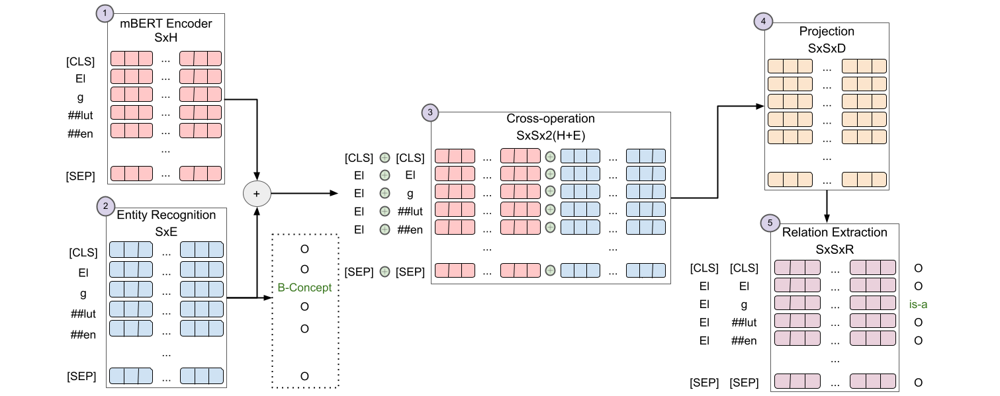

# PUCRJ-PUCPR-UFMG

Repository with the system code presented by the **PUCRJ-PUCPR-UFMG** team in the eHealth Knowledge Discovery 2021.

For more information about the challenge and the tasks, refer to [eHealth site](https://ehealthkd.github.io/2021) and [eHealth repo](https://github.com/ehealthkd/ehealthkd.github.io).

## Model's Architecture




## How to cite

```

@inproceedings{PUCRJ-PUCPR-UFMG2021,
  author    = {Pavanelli, Lucas and
  Rubel Schneider,Elisa Terumi and
  Bonescki Gumiel, Yohan and
  Castro Ferreira, Thiago and
  Ferro Antunes de Oliveira, Lucas and
  Andrioli de Souza, Jo{\~{a}}o Vitor and 
  Meneghel Paiva, Giovanni Pazini and
  Silva e Oliveira, Lucas Emanuel
  Cabral Moro, Claudia Maria and
  Cabrera Paraiso, Emerson and
  Labera, Eduardo and
  Pagano, Adriana},
  title     = {{PUCRJ-PUCPR-UFMG} at eHealth-KD Challenge 2021: A Multilingual BERT-based system for Joint Entity Recognition and Relation Extraction},
  booktitle = {Proceedings of the Iberian Languages Evaluation Forum (IberLEF 2021)},
  year      = {2021}
}

```